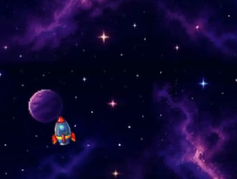

# 🚀 Booooost

**Booooost** is a 2D physics-based rocket action game built with **Unity 6**.

## ✨ Highlights

- Physics-based rocket control
- 6 unique enemy behaviour patterns
- Projectile, stealth, and suicide enemy AI
- Unity Input System-based controls

---

## 🎮 게임 소개

플레이어는 로켓의 방향과 추진력을 조절하며  
다양한 장애물과 적을 피해 최대한 오래 생존하는 것을 목표로 합니다.

## 🕹️ 조작 방법

- `A / D`, `← / →` : 로켓 방향 조절
- `Space`, `W`, `↑`, `Mouse Left Click` : 로켓 추진

---

## ☄ Enemy Behaviours

### ↔ Horizontal Moving Enemy
좌우로 이동하며 플레이어의 이동 경로를 방해합니다.

### ↕ Vertical Moving Enemy
상하로 이동하며 플레이어의 진행을 방해합니다.

### 🔄 Orbit Enemy
특정 지점을 중심으로 원형 궤도를 따라 이동합니다.

### 🔫 Projectile Enemy
플레이어를 향해 투사체를 발사합니다.

### 💥 Suicide Enemy
플레이어가 일정 거리 안으로 접근하면 자폭 공격을 시도합니다.

### 👻 Stealth Enemy
플레이어와의 거리에 따라 투명화 상태로 전환됩니다.

---

## 🛠 Tech Stack

- **Engine:** Unity 6
- **Language:** C#
- **IDE:** Visual Studio Code
- **Version Control:** Git / GitHub

---

## Project Context

Hanshin University  
Computer Animation Term Project, 2026

Special thanks to @nakjun for guidance and feedback throughout the project.
